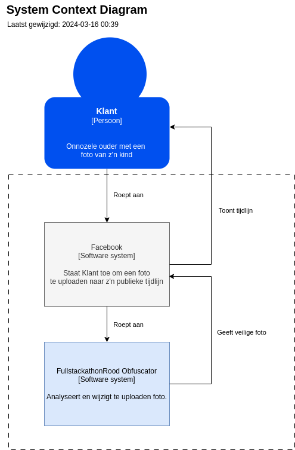
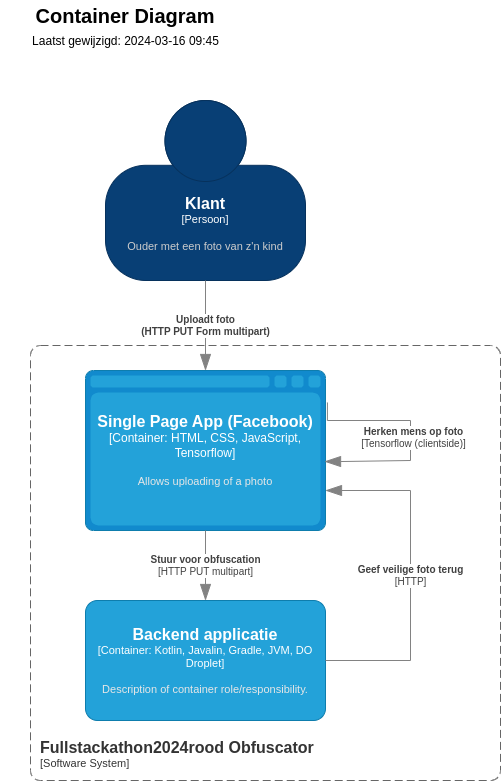

# fullstackathon2024rood

## Authors

- Emil van Galen
- Jasper Bogers
- Rick Suijkerbuijk
- Quinton Weenink
- Gerald van den Hengel

## Documentation

## Achievements

### captain unity
- Brainwave Conductor - 5 pts (brainstoremed)
- Team Harmony - 5 pts (all pushed something)
- Documentation Guru - 5 pts
- Code buddy - 5 pts (all reviewed pull requests)

### cyber sentinel
- none

### doctor stack
- NoSQL Navigator - 5 pts (we kiezen bewust voor geen relationale database)

### Pixel Boy
- The Chroma Explorer - 5 pts (night vision)
- Jakob Nielsen’s Nightmare - 5 pts (nightmare mode)
- Pixel Pioneer - 5 pts (reusable component)

### To claim later on (but already implemented)
- Adaptive mastermind - 5 pts (Pixel Boy)
- Shift left extremist - 5 pts (Doctor Stack) (DependaBot van GitHub Actions toevoegen)
- HotFix haste - 5 pts (Cyber Sentinel) (GitHub Actions CI/CD)
- Compliance champion - 5 pts (Cyber Sentinel) (uplodaded en rendered files worden niet opgeslagen voor of na obfuscation)

## Architecture

### C4

#### System

#### Container

### Backend

#### Goal
This application should accept an HTTP request containing an image, provide it to a tool for image AI obfuscation, and
return the obfuscated image in its response. It should not store either the original nor the obfuscated image.

#### Key technology
* Gradle
* Kotlin
* Javalin

#### API
The application can receive a multipart POST request that contains 2 fields:
- file. This must be a JPEG file (extension .jpg or .jpeg)
- message-text. This is a String that is entirely ignored.

#### Run and use

Build using `./gradlew build`

Run using `./gradlew run`

The application will run at port 8080, will only accept a PUT request.

Example call using cURL:
`curl -X PUT -v -F message-text=testmessage -F file=@backend/src/main/resources/plain_black.jpeg localhost:8080/obfuscate`

### Frontend

#### dev environment
- npm install
- npm run

#### Goal

#### Key technology
* Lit
*
